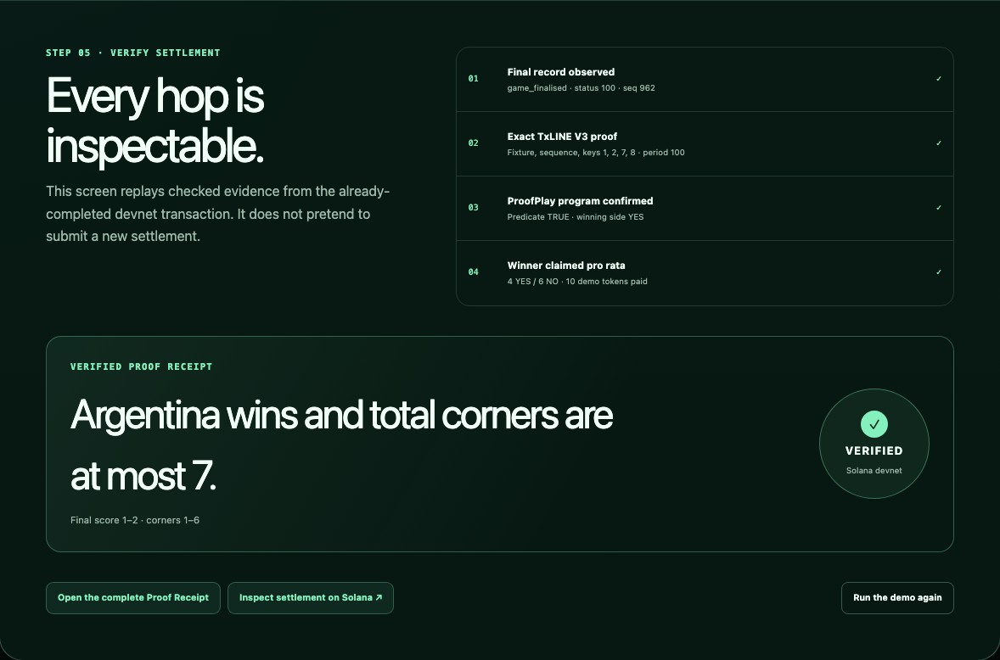
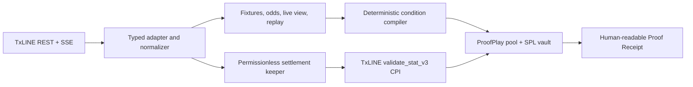

# ProofPlay

Verifiable same-match prediction pools powered by TxLINE and Solana.

[Live app](https://proof-play-txline.peterclawbot.chatgpt.site) · [Wallet-free Judge Demo](https://proof-play-txline.peterclawbot.chatgpt.site/demo) · [Verified Proof Receipt](https://proof-play-txline.peterclawbot.chatgpt.site/receipt) · [Devnet program](https://explorer.solana.com/address/AJwjCjk9sb9SWMiuLWDCDgnL6zFEENgnULfkCYaU5Ar?cluster=devnet)



## Problem and product

Sports prediction products normally ask users to trust both the result feed and
the operator that releases funds. ProofPlay turns readable same-match conditions
into immutable settlement rules, holds dedicated demo tokens in a Solana program,
and resolves the pool from TxLINE's normalized match data and cryptographic V3
proofs. The result is a pool whose question, evidence, winner, and payout are all
inspectable.

The fastest path is `/demo`: a judge can select the verified fixture, compile a
two-leg condition, simulate joining a seeded pool, replay the ordered TxLINE
history, and inspect a real devnet settlement without a wallet, fee, or account.
All financial-looking surfaces are explicitly devnet-only; demo tokens have no
monetary value and the submission offers no prize or real-money wagering.

## Architecture and data flow



TxLINE is the primary sports-data and outcome-verification source. REST
snapshots populate discovery and deterministic replay, SSE supplies ordered live
updates, and the compact V3 proof is passed to the TxLINE program by CPI during
settlement. The browser never receives TxLINE credentials or proof payloads.

## TxLINE endpoints and methods used

The configured TxLINE origin is `https://txline-dev.txodds.com`; the table shows
the complete `/api` paths used by the application and verification tooling.

| TxLINE API or program method             | ProofPlay use                                                                              |
| ---------------------------------------- | ------------------------------------------------------------------------------------------ |
| `POST /api/auth/guest/start`             | Start or renew the server-only guest JWT while retaining the activated API token           |
| `GET /api/fixtures/snapshot`             | Discover World Cup fixtures; filter by `competitionId` and `startEpochDay`                 |
| `GET /api/odds/snapshot/{fixtureId}`     | Display the consensus odds snapshot at an optional `asOf` time                             |
| `GET /api/odds/updates/{fixtureId}`      | Normalize incremental odds updates                                                         |
| `GET /api/scores/snapshot/{fixtureId}`   | Read the latest normalized score and match phase                                           |
| `GET /api/scores/updates/{fixtureId}`    | Read score updates when a snapshot-plus-updates flow is used                               |
| `GET /api/scores/historical/{fixtureId}` | Drive deterministic replay and find the exact finalized record                             |
| `GET /api/scores/stream`                 | Proxy live SSE with reconnect, `Last-Event-ID`, ordering, gap buffering, and deduplication |
| `GET /api/scores/stat-validation`        | Exercise the legacy single-stat proof path in live integration diagnostics                 |
| `GET /api/scores/stat-validation-v3`     | Fetch the compact multi-stat proof for production settlement                               |
| TxLINE `validate_stat_v3` instruction    | Verify the final stat leaves on-chain through CPI from ProofPlay                           |

ProofPlay exposes credential-free same-origin routes under `/api/txline/*`; the
exact mapping, normalized schema, stream guarantees, and redaction behavior are
documented in the [typed adapter contract](docs/txline-adapter.md).

## Deployed devnet evidence

| Artifact                 | Address or transaction                                                                                                                                |
| ------------------------ | ----------------------------------------------------------------------------------------------------------------------------------------------------- |
| ProofPlay program        | [`AJwj…5Ar`](https://explorer.solana.com/address/AJwjCjk9sb9SWMiuLWDCDgnL6zFEENgnULfkCYaU5Ar?cluster=devnet)                                          |
| TxLINE program           | [`6pW6…yP2J`](https://explorer.solana.com/address/6pW64gN1s2uqjHkn1unFeEjAwJkPGHoppGvS715wyP2J?cluster=devnet)                                        |
| Verified production pool | [`3fCN…PhD`](https://explorer.solana.com/address/3fCNRpakrJdsoaG46xFuHqMUK2YZM9FyvwuJediB5PhD?cluster=devnet)                                         |
| TxLINE V3 settlement CPI | [`5DBF…rqWH`](https://explorer.solana.com/tx/5DBFhtF8dmg8iPH63RW74px3BrYbfAG1FZJzEiYpEChsUPrateGudXESKiJuyMxjhunVwPyyAeGYFytXucsqrqWH?cluster=devnet) |
| Winning claim            | [`45tA…xtSX`](https://explorer.solana.com/tx/45tAsxmQu3SqNx3bCo1xq9Y1wxhYAZeL4TgWFPsreGvj9GPsiu5npZQMZw81ySsca5GZ4aQH7z1TTghvKGSsxtSX?cluster=devnet) |

The canonical settlement binds fixture `18241006`, final sequence `962`, goals
`1–2`, corners `1–6`, and the two-leg condition “Participant 2 wins and total
corners are at most 7.” The transaction consumed 210,361 compute units, invoked
TxLINE `ValidateStatV3`, recorded YES as the winner, and the final claim emptied
the 10-token vault. The [secret-free verification report](docs/evidence/proof-settlement-devnet-verification.json)
contains the complete addresses, proof metadata, adversarial rejections, and
accounting result.

## Deterministic resolution

1. The compiler canonicalizes the readable legs, orders stat keys, encodes the
   `validateStatV3` strategy, and hashes the complete condition.
2. Pool creation stores that commitment, compiler version, fixture, stat-key
   order, strategy, cutoff, mint, and vault addresses before deposits begin.
3. The keeper accepts only `game_finalised`, status `100`, positive-sequence
   TxLINE records. Later transport records such as `disconnected` are not final.
4. It requests the V3 proof for the exact finalized record and rejects any
   fixture, sequence, key-order, leaf-count, period, strategy, or root mismatch.
5. The ProofPlay program derives the TxLINE daily-root PDA, calls
   `validate_stat_v3`, records one winner, and permits each winning position to
   claim exactly once.
6. Payouts use remaining-liability accounting so the final winner receives the
   exact rounding remainder and the vault closes with zero outstanding value.

The [condition compiler](docs/condition-compiler.md), [pool program](docs/pool-program.md),
and [replay/keeper/receipt path](docs/replay-keeper-receipt.md) document the
invariants in detail.

## Product documentation

- [MVP product specification](docs/product-spec.md)
- [Domain and state model](docs/state-model.md)
- [Judge demo script](docs/demo-script.md)
- [Hackathon technical overview](docs/submission.md)
- [TxLINE integration feedback](docs/txline-feedback.md)
- [Final submission checklist](docs/submission-checklist.md)
- [TxLINE devnet runbook](docs/txline-devnet.md)
- [Typed TxLINE adapter contract](docs/txline-adapter.md)
- [Condition compiler v1](docs/condition-compiler.md)
- [Anchor pool and escrow program](docs/pool-program.md)
- [Replay, keeper, and Proof Receipt](docs/replay-keeper-receipt.md)
- [Wallet creation and pool participation](docs/wallet-participation.md)
- [Operations and failure runbook](docs/operations-runbook.md)
- [Security, accessibility, and compliance](docs/security-compliance.md)
- [Third-party notices](THIRD_PARTY_NOTICES.md)
- [Architecture decisions](docs/adr/README.md)

## Status

ProofPlay is a working 2026 TxLINE World Cup Hackathon submission. The public
repository contains the deployable app, typed integration boundary, compiler,
keeper, Anchor program, tests, operational/security runbooks, and secret-free
devnet evidence. Project planning and acceptance evidence are tracked in the
[delivery epic](https://github.com/stunt101harm/Proof-play/issues/1).

## Product routes

- `/demo` runs the complete wallet-free judging path against checked devnet evidence.
- `/fixtures` discovers covered normalized TxLINE fixtures with a transparent replay fallback.
- `/matches/18241006` shows historical replay or live SSE, available odds, and the verified pool.
- `/create/18241006` compiles a condition, estimates the transaction, and creates a real devnet pool with a supported wallet.
- `/pools/<address>` verifies readable metadata against the on-chain commitment and exposes only valid join, claim, or refund actions.
- `/receipt` presents the real TxLINE proof, Solana settlement, and payout calculation.
- `/legal` publishes the 18+, devnet, no-value, independence, attribution, and TxLINE data-use safeguards.
- `/api/health` exposes a credential-free web and integration readiness check.

## Prerequisites

- Node.js 22.13 or newer and npm 10 or newer
- Rust and Cargo
- Anchor CLI 0.31.1
- Solana CLI configured for devnet when running program workflows

## Quick start

```bash
npm ci
cp .env.example .env
npm run dev
```

The web workspace prints its local URL when ready. TxLINE credentials are not required for the foundation page; server integrations validate them only when the TxLINE client is created.

Never commit `.env`, wallet keypairs, activated API tokens, or guest JWTs.

## Repository structure

```text
apps/web                  Next.js-compatible web app and server routes
packages/domain           Shared product and state vocabulary
packages/txline           TxLINE network and adapter boundary
packages/condition-engine Versioned condition compiler boundary
packages/replay           Deterministic normalized match replay
packages/receipt          Truthful proof receipt construction
programs/proof_play       Anchor program
scripts/keeper            Settlement keeper process
tests                     Cross-workspace tests
tooling                   Repository validation scripts
```

## Common commands

| Command                                                  | Purpose                                       |
| -------------------------------------------------------- | --------------------------------------------- |
| `npm run dev`                                            | Start the web app                             |
| `npm run build`                                          | Build the deployable web worker               |
| `npm run lint`                                           | Lint the web workspace                        |
| `npm run typecheck`                                      | Typecheck every TypeScript workspace          |
| `npm test`                                               | Check workspace boundaries and run unit tests |
| `npm run test:rendered`                                  | Verify the built app server-renders           |
| `npm run test:e2e`                                       | Run browser, keyboard, a11y, responsive tests |
| `npm run security`                                       | Run secret, compliance, bundle, audit gates   |
| `npm run txline:diagnose`                                | Check TxLINE devnet consistency and funding   |
| `npm run txline:activate`                                | Subscribe and activate local TxLINE access    |
| `npm run txline:recover`                                 | Recover activation for a confirmed subscribe  |
| `npm run txline:renew`                                   | Renew the local guest JWT                     |
| `npm run txline:verify`                                  | Exercise every required TxLINE data path      |
| `npm run anchor:build`                                   | Build the Anchor program                      |
| `npm run anchor:test`                                    | Compile and test the Rust workspace           |
| `npm run program:verify`                                 | Exercise the funded lifecycle on devnet       |
| `npm run program:verify-proof`                           | Prove production TxLINE settlement on devnet  |
| `npm run demo:fund -- <wallet> 20`                       | Fund a judge wallet with devnet demo tokens   |
| `npm run start --workspace=@proof-play/keeper -- --once` | Run one keeper pass                           |
| `npm run check`                                          | Run the complete local validation suite       |

## Environment

The checked-in [`.env.example`](.env.example) lists every current configuration key. Public values are limited to the Solana network, RPC URL, and ProofPlay program ID. TxLINE credentials and keeper wallet paths are server-only.

The optional `HELIUS_API_KEY` is reserved for a private RPC URL if the public devnet endpoint becomes unreliable; it is not required for local foundation work.

## Security, limitations, and TxLINE feedback

The project fails closed on malformed data, proof mismatches, account
substitution, cutoff violations, duplicate claims/refunds, and unknown
transaction state. CI runs unit, browser, accessibility, rendered-worker, Rust,
secret, client-bundle, compliance, and high/critical dependency gates. See the
[security and compliance review](docs/security-compliance.md).

This is an experimental devnet prototype, not a production gambling or
financial service. It has no mainnet assets, production economic audit, SLA,
indexer, or always-on keeper deployment. The keeper is permissionless and
reproducible, while the settled judge fixture and receipt make review independent
of background infrastructure.

Our detailed [TxLINE feedback](docs/txline-feedback.md) highlights the normalized
cross-endpoint model, SSE/history pairing, and on-chain proof primitive as major
strengths. The main integration friction was finality semantics across later
transport records, guest/API-token lifecycle, snapshot window discovery, and
the absence of the observed API sequence from the V3 on-chain payload.
