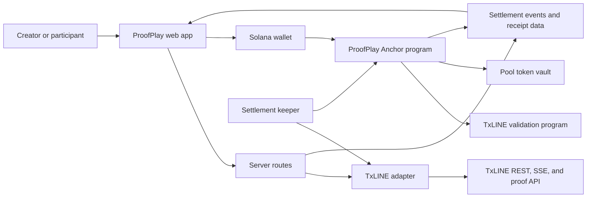
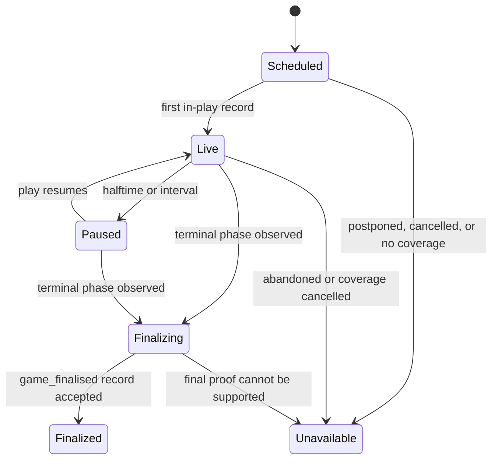
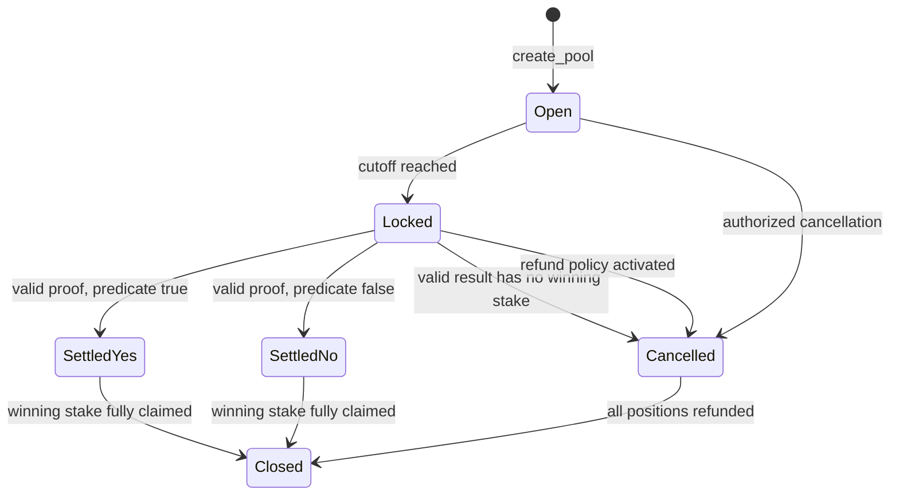
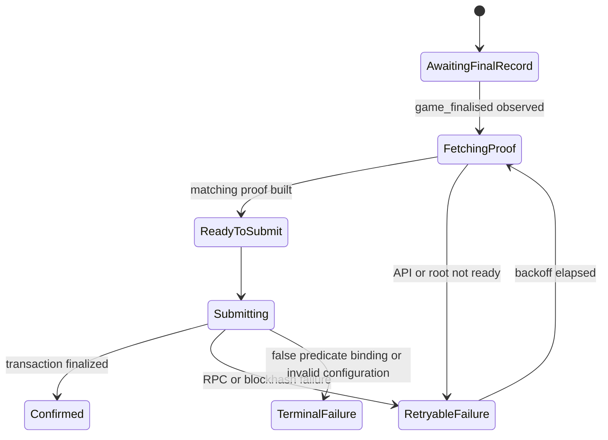

# ProofPlay domain and state model

This document defines the shared vocabulary and lifecycle rules for the web app, TxLINE adapter, condition engine, Anchor program, keeper, and Proof Receipt.

## System boundaries



TxLINE owns sports facts and cryptographic validation. ProofPlay owns condition compilation, pool accounting, UI state, and presentation of the resulting evidence.

## Identifiers

| Identifier            | Type                                                           | Rule                                                      |
| --------------------- | -------------------------------------------------------------- | --------------------------------------------------------- |
| `fixtureId`           | Unsigned integer represented as a decimal string in TypeScript | Must come from the selected TxLINE network                |
| `sequence`            | Positive integer                                               | Must be observed in a real score record; zero is invalid  |
| `poolAddress`         | Solana public key                                              | Pool PDA derived by the Anchor program                    |
| `positionAddress`     | Solana public key                                              | Position PDA derived from pool and participant wallet     |
| `conditionCommitment` | 32-byte hash                                                   | SHA-256 of the versioned canonical condition document     |
| `compilerVersion`     | Positive integer                                               | Selects immutable normalization and compilation semantics |

## Data source mode

Every match view carries one explicit source mode:

| Mode               | Meaning                                                       | Verification claim allowed                                               |
| ------------------ | ------------------------------------------------------------- | ------------------------------------------------------------------------ |
| `live`             | Events are arriving from the authenticated TxLINE SSE path    | Current values are TxLINE-sourced; settlement still requires final proof |
| `historicalReplay` | Authenticated TxLINE history is replayed at accelerated speed | Values are historical TxLINE data, not live                              |
| `simulated`        | Synthetic data exercises the UI or offline fallback           | No TxLINE verification claim for the simulated result                    |

Source mode is presentation metadata and is not stored as part of the pool's settlement condition.

## Match lifecycle

ProofPlay normalizes detailed TxLINE phases into a smaller UI lifecycle while preserving the raw phase/status fields.



| ProofPlay state | Examples of TxLINE phase                                      | Product behavior                        |
| --------------- | ------------------------------------------------------------- | --------------------------------------- |
| `scheduled`     | Not started                                                   | Pools may accept deposits before cutoff |
| `live`          | First half, second half, extra time, penalties                | Conditions show provisional status only |
| `paused`        | Halftime, extra-time interval, waiting for penalties          | Conditions remain provisional           |
| `finalizing`    | Ended phase observed without accepted finalization proof      | Deposits closed; settlement pending     |
| `finalized`     | `game_finalised`, `statusId=100`, `period=100`                | Eligible for proof-backed settlement    |
| `unavailable`   | Postponed, cancelled, abandoned, coverage suspended/cancelled | Pool follows retry or refund policy     |

## Canonical condition

The canonical condition is the single source of truth for display, compilation, commitment, settlement, and receipt generation.

Illustrative schema:

```json
{
  "version": 1,
  "fixtureId": "18237038",
  "operator": "all",
  "legs": [
    {
      "kind": "participantWins",
      "participant": 1
    },
    {
      "kind": "totalCorners",
      "comparison": "atLeast",
      "threshold": 9
    }
  ]
}
```

Canonicalization rules:

- Only documented fields are present; no `undefined`, display names, odds, or timestamps are included.
- `fixtureId` is a base-10 string with no leading zeros.
- Thresholds and participant positions are integers.
- Duplicate legs are rejected; valid legs are normalized and sorted by a versioned stable comparator before hashing.
- JSON uses RFC 8785 JSON Canonicalization Scheme semantics.
- The commitment is SHA-256 over the UTF-8 canonical JSON bytes.
- Compiler version 1 permits one or two `all` legs and at most four unique stat keys.

## Compilation output

```ts
type CompiledConditionV1 = {
  compilerVersion: 1;
  validationMethod: "validateStatV2";
  fixtureId: string;
  condition: CanonicalConditionV1;
  humanStatement: string;
  canonicalJson: string;
  conditionCommitment: Uint8Array; // 32 bytes
  conditionCommitmentHex: string;
  statKeys: number[]; // stable order
  strategy: TxlineValidationStrategy;
  compiledLegs: CompiledConditionLegV1[];
};
```

The `humanStatement` is derived output and is never independently accepted as settlement input. Strategy indexes refer to positions in `statKeys`, not to the numeric value of a stat key. TxLINE V2 requires every requested index to be evaluated exactly once, so compiler v1 rejects compound legs whose stat-key coverage overlaps.

## Pool lifecycle

The on-chain program should keep the durable enum small. More detailed UI and keeper phases are derived from match/proof/transaction state.



| Durable pool state | Deposits              | Settlement                     | User action               |
| ------------------ | --------------------- | ------------------------------ | ------------------------- |
| `open`             | Allowed before cutoff | Not allowed                    | Join YES or NO            |
| `locked`           | Rejected              | Allowed with valid final proof | Wait                      |
| `settledYes`       | Rejected              | Rejected                       | YES positions claim       |
| `settledNo`        | Rejected              | Rejected                       | NO positions claim        |
| `cancelled`        | Rejected              | Rejected                       | All positions refund      |
| `closed`           | Rejected              | Rejected                       | Read-only receipt/history |

### Pool record

```ts
type Pool = {
  address: string;
  creator: string;
  fixtureId: string;
  conditionCommitment: string;
  compilerVersion: 1;
  cutoffUnixSeconds: number;
  tokenMint: string;
  yesAmount: bigint;
  noAmount: bigint;
  remainingPoolAmount: bigint;
  remainingWinningStake: bigint;
  state:
    "open" | "locked" | "settledYes" | "settledNo" | "cancelled" | "closed";
  settledSequence?: number;
  settlementTransaction?: string;
};
```

The eventual Anchor account layout may use fixed-width integer/public-key fields, but it must preserve these semantics.

## Position lifecycle

One wallet has one aggregate position per pool and side in the MVP. If the program permits deposits on both sides, each side must use a distinct position PDA.

| Position state | Meaning                                    |
| -------------- | ------------------------------------------ |
| `active`       | Deposit confirmed; pool not resolved       |
| `claimable`    | Position is on the winning side            |
| `lost`         | Position is on the losing side             |
| `refundable`   | Pool was cancelled or has no winning stake |
| `claimed`      | Winner payout completed                    |
| `refunded`     | Original stake returned                    |

Client-only `depositPending`, `claimPending`, and `refundPending` states wrap submitted transactions but are not durable program states.

## Payout accounting

Let:

- `R` be the vault's remaining token balance.
- `W` be the remaining unclaimed winning stake.
- `p` be the claimant's winning stake.

The claim amount is:

```text
claim = floor(R * p / W)
```

After payment, the program updates `R = R - claim` and `W = W - p`. The final valid claimant receives the exact remaining balance. This conserves all escrowed base units without a privileged dust sweep.

If the selected winning side has zero stake, the pool becomes refundable rather than assigning the losing side's funds to an operator.

## Settlement pipeline

Keeper state is operational and not stored in the pool account:



The keeper is permissionless in effect: it may pay transaction fees and transport the proof, but it cannot choose the winner or alter the condition.

## Proof Receipt

The receipt is a read model assembled from the canonical condition, TxLINE proof metadata, pool account, and finalized transaction.

| Section    | Required fields                                                  |
| ---------- | ---------------------------------------------------------------- |
| Market     | Pool address, human statement, fixture, cutoff, final state      |
| Condition  | Canonical legs, compiler version, commitment, required stat keys |
| Result     | Final sequence, phase/status, relevant verified stat values      |
| Validation | TxLINE network/program, root timestamp/day, predicate result     |
| Settlement | ProofPlay program, transaction, slot/confirmation, winning side  |
| Payout     | YES total, NO total, user stake, formula, claimed amount         |
| Provenance | `live`, `historicalReplay`, or `simulated` UI source label       |

A simulated receipt must be visibly marked and must not display “on-chain verified” unless its validation and settlement fields point to actual matching devnet evidence.

## Cross-component invariants

- The selected TxLINE API host, IDL, program ID, RPC network, and proof root network must match.
- A sequence is positive and belongs to the configured fixture.
- A condition is immutable after pool creation.
- The condition displayed to users is generated from the canonical document committed on-chain.
- No deposit succeeds after cutoff or after leaving `open`.
- A pool settles at most once.
- A position claims or refunds at most once.
- Vault outflow never exceeds confirmed deposits.
- Provisional in-play truth never triggers final settlement.
- Missing or invalid verification produces a pending/error state, never an inferred winner.
