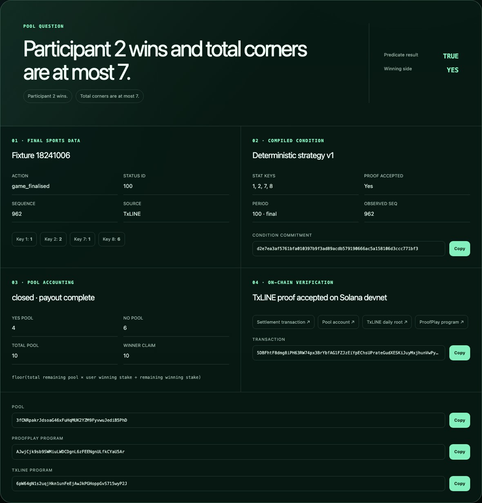

# ProofPlay hackathon technical overview

## Submission links

- Application: <https://proof-play-txline.peterclawbot.chatgpt.site>
- Wallet-free Judge Demo: <https://proof-play-txline.peterclawbot.chatgpt.site/demo>
- Verified Proof Receipt: <https://proof-play-txline.peterclawbot.chatgpt.site/receipt>
- Public repository: <https://github.com/stunt101harm/Proof-play>
- Devnet program: <https://explorer.solana.com/address/AJwjCjk9sb9SWMiuLWDCDgnL6zFEENgnULfkCYaU5Ar?cluster=devnet>
- Canonical settlement: <https://explorer.solana.com/tx/5DBFhtF8dmg8iPH63RW74px3BrYbfAG1FZJzEiYpEChsUPrateGudXESKiJuyMxjhunVwPyyAeGYFytXucsqrqWH?cluster=devnet>
- Demo video: add the final YouTube or Loom URL after upload

## Core idea

ProofPlay is a same-match prediction-pool protocol whose rules, sports result,
and payout can be inspected independently. A fan builds a condition in readable
blocks—for example, “Participant 2 wins AND total corners are at most 7.” The
condition compiler converts those blocks into a canonical commitment and exact
TxLINE `validateStatV3` strategy. A Solana program escrows a dedicated demo SPL
token, and a permissionless keeper submits the final TxLINE V3 proof. Winners
claim the complete vault pro rata without trusting an operator to choose the
result.

The public Judge Demo requires no wallet or fee. It reuses the production
condition builder and replay reducer, clearly labels simulated participation,
and finishes at a receipt backed by a real devnet settlement.

## Why TxLINE is indispensable

TxLINE is the primary source for fixture identity, participant metadata,
consensus odds, score/stat updates, match finality, ordered historical replay,
and the cryptographic evidence used on-chain. ProofPlay uses:

- `POST /api/auth/guest/start` for renewable server authentication;
- fixture, odds, and score snapshot/update endpoints for product views;
- `GET /api/scores/stream` for live SSE;
- `GET /api/scores/historical/{fixtureId}` for deterministic judge replay;
- the single-stat proof endpoint for integration diagnostics;
- `GET /api/scores/stat-validation-v3` for the compact production proof; and
- TxLINE's on-chain `validate_stat_v3` instruction by CPI during settlement.

The complete endpoint-to-method table is in the [README](../README.md#txline-endpoints-and-methods-used),
and the normalization/stream contract is in [`txline-adapter.md`](txline-adapter.md).

## Technical highlights

- One versioned domain model powers live SSE, snapshots, replay, compiler input,
  keeper finality, and the receipt.
- SSE reconnects with `Last-Event-ID`, bounded exponential backoff, sequence
  ordering, deduplication, and credential-free telemetry.
- The compiler rejects duplicate, contradictory, unsupported, or out-of-range
  conditions before pool creation.
- Immutable pool accounts bind the fixture, condition hash, compiler, stat-key
  order, proof strategy, mint, cutoff, and vault.
- Settlement is permissionless, but the caller cannot choose the fixture,
  strategy, stat values, root, or winner.
- Remaining-liability payout accounting conserves every base unit, including
  integer rounding remainder.
- The receipt fails closed if finality, proof, winner, program, or payout fields
  disagree.

## Deployed proof

The canonical settlement transaction invokes ProofPlay and then TxLINE
`ValidateStatV3`. TxLINE returned true for full-game stat keys `1`, `2`, `7`,
and `8`; ProofPlay recorded YES as the winner. The seeded pool contained 4 YES
and 6 NO demo tokens, and the winning claim paid the full 10-token vault.

The public evidence report records transaction size, 210,361 compute units,
program/root accounts, proof leaves, condition commitment, claim accounting,
and adversarial fixture/period/timestamp/strategy/root/value/proof rejections.

## Security and limitations

TxLINE tokens and wallet keypairs are never shipped to the browser or
repository. Server routes redact upstream errors, the client bundle and tracked
files are scanned for credentials, and financial-looking routes carry persistent
18+/devnet/no-value messaging. The public app does not redistribute raw TxLINE
payloads or a standalone dataset.

ProofPlay is an experimental devnet prototype. It is not a production gambling,
investment, or financial service; it accepts no payment and offers no prize.
Production use would require a mainnet deployment, independent economic and
program audits, durable indexing, service-level monitoring, jurisdiction review,
and an always-on keeper/operator strategy.

## Reproduction

`npm ci && npm run check` performs formatting, workspace, lint, TypeScript,
unit, web build, secret/compliance/dependency, rendered-worker, browser, and Rust
program checks. Funded devnet lifecycle and proof-settlement verifiers are
documented in [`pool-program.md`](pool-program.md). The wallet-free `/demo` path
is the recommended judge workflow.

## TxLINE feedback

The integration experience, strongest product qualities, concrete friction,
and suggested improvements are documented in [`txline-feedback.md`](txline-feedback.md).
